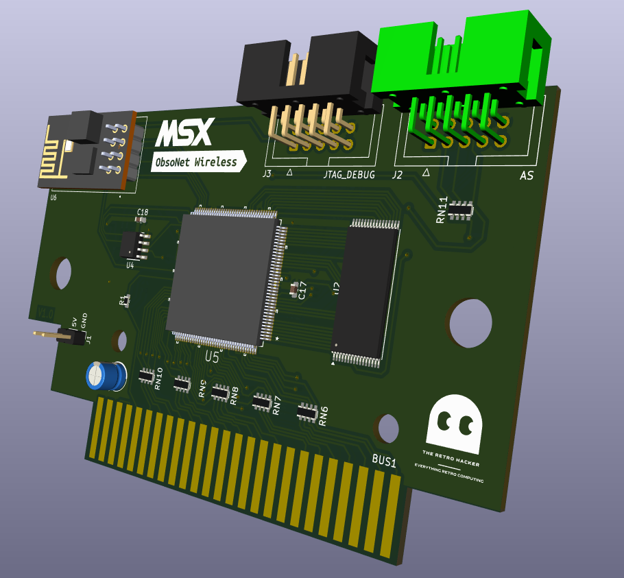

# obsonet-wireless
Repository to host source files for the Obsonet Wireless

The Obsonet Wireless is a cartridge for the MSX line of computers that implements a wireless network interface. It is based on the ESP8266 module and is compatible with the Obsonet cartridge.

The cartridge is based on a EP1C3T144C8 FPGA and the ESP8266 module. The FPGA is responsible for interfacing the ESP8266 module with the MSX bus and providing the necessary logic to implement the required functionality.

The UNAPI stack developed by Konamiman is used to provide the network interface to the MSX software. The ESP8266 firmware was developed by Oduvaldo Pavan Jr and adapted to the Obsonet Wireless by The Retro Hacker.

The Obsonet Wireless is a work in progress and is not yet available.

 

## Repository structure

The repository is organized as follows:

## Bill of Materials

References	Value	Footprint	Quantity	Link
C1, C3, C4, C5, C6, C7, C8, C9, C10, C11, C12, C13, C14, C15, C16, C17, C18	100nF	C_0603_1608Metric	17	
C2	100uF	CP_Radial_D5.0mm_P2.50mm	1	
R3, R4, R5	1K	R_0603_1608Metric	3	
R1	330	R_0603_1608Metric	1	
R2	10	R_0603_1608Metric	1	
U1	AMS1117-3.3	SOT-223-3_TabPin2	1	
U2	~	TSOP-I-32_18.4x8mm_P0.5mm	1	
U3	AMS1117-1.5	SOT-223-3_TabPin2	1	
U4	EPCS1SI8N	SOIC127P600X175-8N	1	
U5	EP1C3T144C8N	QFP50P2200X2200X160-144N	1	
U6	ESP-01	MODULE_ESP-01	1	
Y1	SG-310SCN_50.0000MJ3	SG310SCN500000MJ3	1	
RN1, RN2, RN3, RN4, RN5, RN6, RN7, RN8, RN9, RN10	330	R_Array_Convex_4x0603	10	
			1	
			1	
RN11	10K	R_Array_Convex_4x0603	1	
J1	Conn_01x02	PinHeader_1x02_P2.54mm_Vertical	1	
J2	AS	IDC-Header_2x05_P2.54mm_Vertical	1	
J3			1	

## Schematics

To be updated...

## Firmware

To be updated...

## FPGA

To be updated...

## License

This work is licensed under a [Creative Commons Attribution-NonCommercial-ShareAlike 4.0 International License](http://creativecommons.org/licenses/by-nc-sa/4.0/).

Original version build by Daniel Berdugo and Nestor Soriano. Reloaded version by Cristiano Goncalves. 

* If you remix, transform, or build upon the material, you must distribute your contributions under the same license as the original.
* You may not use the material for commercial purposes.
* You must give appropriate credit, provide a link to the license, and indicate if changes were made. You may do so in any reasonable manner, but not in any way that suggests the licensor endorses you or your use.

**ATTENTION**

This project was made for the retro community and not for commercial purposes. So only retro hardware forums and individual people can build this project.

THE SALE OF ANY PART OF THIS PROJECT WITHOUT EXPRESS AUTHORIZATION IS PROHIBITED!

